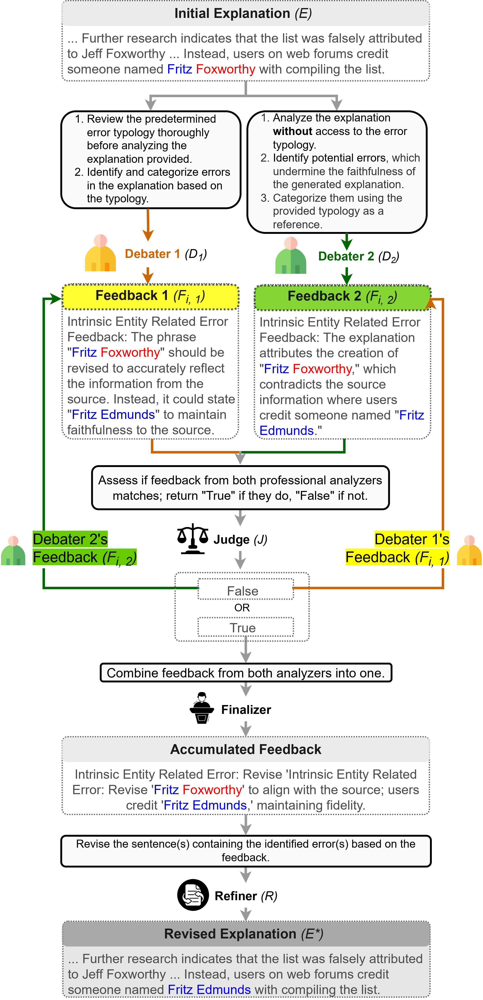

# Can LLMs Produce Faithful Explanations for Fact-Checking? Towards Faithful Explainable Fact-Checking via Multi-Agent Debate

Kyungha Kim, Sangyun Lee, Kung-Hsiang Huang, Hou Pong Chan, Manling Li, Heng Ji

Paper link: [https://arxiv.org/abs/2402.07401](https://arxiv.org/abs/2402.07401)


## Abstract

Fact-checking research has extensively explored verification but less so the generation of natural-language explanations, crucial for user trust. While Large Language Models (LLMs) excel in text generation, their capability for producing faithful explanations in fact-checking remains underexamined. Our study investigates LLMs' ability to generate such explanations, finding that zero-shot prompts often result in unfaithfulness. To address these challenges, we propose the Multi-Agent Debate Refinement (MADR) framework, leveraging multiple LLMs as agents with diverse roles in an iterative refining process aimed at enhancing faithfulness in generated explanations. MADR ensures that the final explanation undergoes rigorous validation, significantly reducing the likelihood of unfaithful elements and aligning closely with the provided evidence. Experimental results demonstrate that MADR significantly improves the faithfulness of LLM-generated explanations to the evidence, advancing the credibility and trustworthiness of these explanations.



## Methodology

We propose the **Multi-Agent Debate Refinement (MADR)** framework to improve the faithfulness of LLM-generated fact-checking explanations. MADR uses multiple LLM agents in a debate-and-refinement process:

1. **Initial Explanation**: A zero-shot LLM generates an explanation.
2. **Debaters' Feedback**: Two agents independently detect errors—one using a predefined error typology and the other without it.
3. **Feedback Refinement**: The agents exchange and refine feedback, identifying overlooked issues.
4. **Judge Evaluation**: A third agent (Judge) ensures consensus between the debaters.
5. **Refinement**: A final agent (Refiner) revises the explanation based on the combined feedback.

MADR enhances explanation accuracy through iterative feedback and refinement with bidirectional thinking process.


## Data

Experiments are conducted on the [PolitiHop multi-hop fact-checking dataset](https://github.com/copenlu/politihop). PolitiHop consists of 445 test set instances, where each instance contains a claim and multiple pieces of evidence. The veracity of a claim can only be determined by reasoning across multiple pieces of evidence and the claim.


## Type of Errors

To facilitate analysis, we define a novel typology of common errors and unfaithfulness issues that arise in LLM-generated explanations. The typology is as follows:

- **Intrinsic Entity-Related Errors**: Intrinsic entity-related errors occur when there is a mistake in representing named entities, quantities, dates, or other surface realizations from the given source within the generated explanation.  
  *Example*: Incorrectly combining distinct entities from the given source.

- **Extrinsic Entity-Related Errors**: Extrinsic entity-related errors involve the introduction of new entities that are not present in the given source into the generated explanation.  
  *Example*: Hallucinating new entities that do not exist in the source.

- **Intrinsic Event-Related Errors**: Intrinsic event-related errors pertain to mistakes in representing events mentioned in the generated explanation, leading to incorrect claims about events.  
  *Example*: Making inaccurate claims about events mentioned in the explanation.

- **Extrinsic Event-Related Errors**: Extrinsic event-related errors occur when the generated explanation includes new events that are not present in the given source.  
  *Example*: Introducing fabricated events that are not supported by the source.

- **Intrinsic Noun Phrase-Related Errors**: Intrinsic noun phrase-related errors are mistakes related to noun phrases, excluding entity-specific errors. They may involve miscombining noun phrases with incorrect modifiers from the given source.  
  *Example*: Incorrectly combining a noun phrase with the wrong modifier from the source.

- **Extrinsic Noun Phrase-Related Errors**: Extrinsic noun phrase-related errors involve the introduction of new noun phrase modifiers that are not present in the given source into the generated explanation.  
  *Example*: Hallucinating new noun phrase modifiers not supported by the source.

- **Reasoning Coherence Errors**: Reasoning coherence errors occur when there are logical flaws in the flow of reasoning within the generated explanation, leading to a lack of coherence or weak support for the claim.  
  *Example*: Presenting evidence that does not logically connect to the main claim, resulting in a disjointed explanation.

- **Overgeneralization Errors**: Overgeneralization errors happen when the generated explanation makes sweeping statements or draws conclusions that go beyond the scope of the evidence provided.

- **Irrelevant Evidence Errors**: Irrelevant evidence errors occur when the generated explanation includes evidence that is not directly related to the claim, leading to confusion and lack of support for the main argument.  
  *Example*: Including evidence that is tangential or unrelated to the claim being explained.


## Citation

If you find this work useful for your research or projects, please cite it using the following BibTeX entry:

```bibtex
@misc{kim2024llmsproducefaithfulexplanations,
      title={Can LLMs Produce Faithful Explanations For Fact-checking? Towards Faithful Explainable Fact-Checking via Multi-Agent Debate}, 
      author={Kyungha Kim and Sangyun Lee and Kung-Hsiang Huang and Hou Pong Chan and Manling Li and Heng Ji},
      year={2024},
      eprint={2402.07401},
      archivePrefix={arXiv},
      primaryClass={cs.CL},
      url={https://arxiv.org/abs/2402.07401}, 
}
